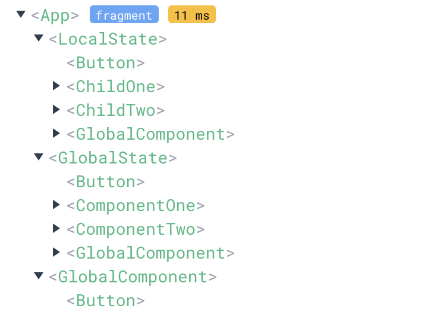

## Estado Jerarquizado


Uno podría pasar el estado como propiedades (props en react) a los componentes hijos, pero esto solo es recomendable hasta cierto punto, por ejemplo, una jerarquía de componentes de 3 niveles, como máximo. Si se requiere pasar el estado a componentes más profundos, se recomienda usar un estado global.

### React

En React, se puede compartir estado local, usando el hook `useState`.

Dentro de un componente padre, como  `<App />`, se crea el estado, y se pasa como propiedades a los componentes hijos, como `<ReactChildComponent />`.

```js
const [count, setCount] = useState
... 
<ReactChildComponent count={count} setCount={setCount} />
```

dentro de `<ReactChildComponent />` se puede actualizar el estado de `<App />`, usando el prop `setCount`:.

```js
export function ReactChildComponent({count, setCount}) {
  return (
    <div>
      <p>Count: {count}</p>
      <button onClick={() => setCount(count + 1)}>Increment</button>
    </div>
  )
}
```

Tanto el estado, `count`, como la función para actualizar el estado, `setCount`, se pasan como propiedades al componente hijo, y al componente del hijo, y así sucesivamente. De esta manera se puede compartir un estado entre un padre y sus hijos.

### Vue

En vue también se puede compartir estado local, usando refs, que son valores mutables:

```js
import { ref } from 'vue'

const count = ref(0)

const updateCount = () => {
  count.value++
}
...
<VueChildComponent :count=count :updateCount=updateCount />
```

Dentro de `<VueChildComponent />` se puede actualizar el estado de `<App />` a través de la propiedad `updateCount`:

```js
defineProps<{ count: number, updateCount: () => void }>()

</script>

<template>
 <div>Child Component
    <div> {{count}}</div>
    <button @click="updateCount">
      Increment  count
    </button> 
  </div>
 
</template>
```

## Estado Global

### React

En el ecosistema de React, existen muchas opciones de estado global. Algunas son Redux,
zustand, jotai, recoil, y el propio Context API de React.

Con una libreria como estas, se puede crear un estade centralizado, y compartirlo entre componentes sin tener que pasar el estado a través props.


En una jerarquía de 4 niveles, es mejor usar un estado global, como Redux, Zustand, Recoil, Jotai, o React.Context. Con una de estas librerías, el estado se consume de una forma similar a como se hace con las propiedades, pero el estado se almacena en un solo lugar, y los componentes hijos pueden acceder a él sin necesidad de pasarle las propiedades.

Este tipo de estados no requieren de un componente padre, y pueden ser usados en cualquier parte de la aplicación.


En la imagen de arriba se puede ver un ejemplo de una jerarquía de componentes en react. `<GlobalComponent />`, `<GlobalState/>`, `<ComponentOne />`, y `<ComponentTwo />` pueden accedor a un mismo estado global, usando `jotai`, sin pasar el estado como propiedades.

### Vue

Vue tiene una solución de estado global, se llama `reactive`. También hay otroas opciones
como Vuex, y Pinia.

Podemos crear un estado global, usando `reactive`, asi:

```js
import { reactive } from "vue";

export const store = reactive({
  count: 0,
});
```

Y podemos acceder al estado global, usando `store`, y mutarlo:

```js
import { store } from "./store";

const updateCount = () => {
  store.count++;
};
```

Cualquier componente que este leyendo de `store`, se actualizará cuando el estado cambie.



En la imagen de arriba se puede ver un ejemplo de una jerarquía de componentes en vue. `<GlobalComponent />`, `<GlobalState/>`, `<ComponentOne />`, y `<ComponentTwo />` pueden accedor a un mismo estado global, usando `reactive`, sin pasar el estado como propiedades usando.

### Ejemplos

Este repositorio contiene ejemplos de como usar estado local y global en React y Vue.

En ambos directorios, `react/` y `vue/`, se puede poner a correr cada proyecto con:

 ```bash
 yarn install
 ```

```bash
yarn dev
```

#### react

```bash
├── App.tsx
├── Global
│   ├── ComponentOne.tsx
│   ├── ComponentTwo.tsx
│   ├── GlobalComponent.tsx
│   ├── GlobalState.tsx
│   └── store.ts
├── Local
│   ├── ChildOne.tsx
│   ├── ChildTwo.tsx
│   └── LocalState.tsx
```

Dentro del directorio `Global/`, el archivo `store.ts` contiene un ejemplo de un estado global, usando librería [`jotai`](https://jotai.org/). `<GlobalState />`, `<ComponentOne />`, `<ComponentTwo />`, y `<GlobalComponent />` consumente este estado global. Leen y escriben sobre mismo valor.

Los copmponentes dentro del directorio `Local/`, reciben props del estado creado en `<App />` y lo mutan a través de otro prop que tambien reciben. Con este tipo de estado, cada consumidor require que el estado y una función para alterar el estado sean pasadas como props, creando mucha complejidad cuando hay muchos componentes anidados.

#### vue

```bash
├── App.vue
├── components
│   ├── ChildOne.vue
│   ├── ChildTwo.vue
│   ├── ComponentOne.vue
│   ├── ComponentTwo.vue
│   ├── GlobalComponent.vue
│   ├── GlobalState.vue
│   ├── LocalState.vue
│   └── store.ts
```

Dentro del directorio `components/`, el archivo `store.ts` contiene un ejemplo de un estado global, usando la funcion [`reactive`](https://v3.vuejs.org/guide/reactivity-fundamentals.html#reactive) de `vue`. `<GlobalState />`, `<ComponentOne />`, `<ComponentTwo />`, y `<GlobalComponent />` consumente este estado global sin necesidad de recibir el estado como props de un componente padre. Por otro lado, los componentes `<ChildOne />` y `<ChildTwo />` reciben el estado como props, y lo mutan a través de otro prop que tambien reciben.
